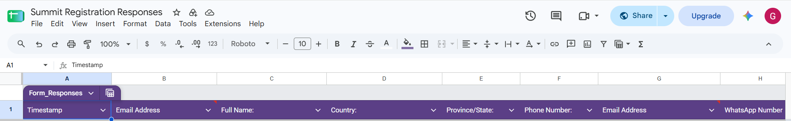

# Cereal+ Africa Pan African Summit — Registration Analytics

> **Data Analytics Portfolio Project | Campaign Performance & Registration Insights**
## 👩🏽‍💻 About Me

**Glory Maurice**

Data Analyst passionate about turning raw data into clear insights that support better business decisions.

I work with data collection, data cleaning, analysis, visualization, and business intelligence, with a focus on creating practical and easy-to-understand reports.

### 🔗 Connect With Me

- **LinkedIn:** [Glory Maurice](https://www.linkedin.com/in/glory-maurice-9309b43a2/)
- **GitHub:** [Glory601](https://github.com/Glory601)

## 📊 Project Overview

This project analyzes registration data for the **Cereal+ Africa Pan African Summit** to evaluate campaign performance, understand participant demographics, identify effective registration channels, and track progress toward the registration target.

The project transforms registration data into **clear business insights through data analysis and Power BI visualization**, helping stakeholders understand what is working and where further campaign action is needed.

### 📌 At a Glance

| Metric | Result |
|---|---:|
| **Total Registrations** | **68** |
| **Registration Target** | **80** |
| **Target Achievement** | **85%** |
| **Week 4 Registrations** | **22** |
| **Week 4 Growth** | **69%** |

## 📊 Dashboard Preview


## 🎯 Business Problem

The summit team needed a clear and reliable way to monitor registration performance throughout the campaign.

The analysis focused on answering key business questions:

- How many participants registered?
- How close were registrations to the target?
- Which channels generated the most registrations?
- Who were the major participant groups?
- Where were participants registering from?
- How did registration performance change over time?
- What actions could improve registration performance?
---


## 🎯 Project Objectives

1. Track registration performance against the target.
2. Analyze participant categories and geographic distribution.
3. Identify the strongest registration sources.
4. Monitor registration trends and week-over-week growth.
5. Present findings through an interactive Power BI dashboard.
6. Generate practical recommendations for improving campaign performance.

---

## 🛠️ Tools & Skills

### Tools

- **Microsoft Power BI** — Dashboard development and data visualization
- **Google Sheets** — Registration data collection and tracking
- **GitHub** — Project documentation and portfolio presentation

### Analytical Skills

- Data Cleaning
- Exploratory Data Analysis
- Data Visualization
- KPI Development
- Trend Analysis
- Campaign Performance Analysis
- Business Reporting
- Data-Driven Recommendations

---

## 🔄 Analytics Process

### 1. Data Collection

Registration responses were collected and tracked using a structured registration database.

### 2. Data Preparation

The registration data was reviewed and organized for analysis, with relevant fields used to understand participant characteristics, registration sources, locations, and registration activity over time.

### 3. Data Analysis

The data was analyzed across key dimensions including:

- Registration volume
- Participant category
- Registration source
- Country
- Daily registration activity
- Weekly performance

### 4. Dashboard Development

The cleaned data was transformed into a Power BI dashboard containing KPIs, charts, participant breakdowns, geographic analysis, and registration trends.


---

## 🔍 Key Insights

### 1. Strong Progress Toward Registration Target

The campaign achieved **68 registrations**, reaching **85% of the 80-registration target**.

This indicates strong overall campaign performance, while also showing that additional outreach was needed to close the remaining gap.

### 2. Week 4 Showed Strong Momentum

Week 4 recorded **22 registrations**, representing **69% growth**.

The increase suggests that activities during the final week were effective in driving additional registrations.

### 3. WhatsApp Was the Leading Registration Channel

**WhatsApp generated 37 registrations**, making it the strongest identified acquisition channel.

This suggests that direct, shareable communication was highly effective for reaching potential participants.

### 4. Agribusiness Owners Were the Largest Participant Group

Agribusiness owners recorded **17 registrations**, followed by commercial farmers with **13** and smallholder farmers with **11**.

This provides useful insight into the audience segments showing the strongest interest in the summit.

### 5. The Campaign Reached Participants Across Africa

**Nigeria accounted for the majority of registrations**, while participants were also recorded from other African countries.

This demonstrates that the campaign achieved broader regional reach beyond its primary market.
---

## 💡 Recommendations

Based on the analysis, the following actions could improve future campaign performance:

1. **Prioritize WhatsApp as a key acquisition channel**  
   WhatsApp generated the highest number of registrations and should remain a major channel for future outreach campaigns.

2. **Replicate the activities that drove Week 4 growth**  
   The 69% increase in Week 4 registrations suggests that successful activities during this period could provide a useful model for future campaigns.

3. **Strengthen engagement with high-interest participant segments**  
   Agribusiness owners and commercial farmers showed strong participation. Future campaigns should continue developing targeted messaging for these groups.

4. **Expand outreach across underrepresented markets**  
   Since Nigeria accounted for the majority of registrations, additional localized outreach could help increase participation from other African markets.

5. **Monitor campaign KPIs continuously**  
   Tracking registrations, acquisition channels, participant segments, and progress toward targets regularly can help the campaign team identify gaps and respond quickly.

---

## 🏆 Results

The analysis provided a clear view of registration performance and helped transform registration data into actionable campaign insights.

### Final Performance

**68 registrations achieved**

**85% of the 80-registration target**

**22 registrations in Week 4**

**69% Week 4 growth**

The dashboard provided a centralized view of campaign performance, participant composition, acquisition channels, and geographic reach.

---

## 📷 Project Screenshots

### Final Power BI Dashboard


### Registration Tracking




---

## 📁 Project Structure

```text
cereal-africa-pan-african-summit-analysis/
│
├── README.md
│
├── data/
│   └── README.md
│
├── dashboard/
│   └── README.md
│
├── documentation/
│   └── README.md
│
└── screenshots/
    └── README.md
